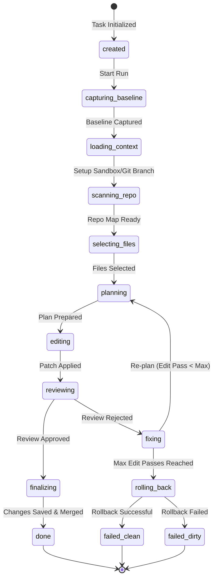

# RDT-v2 Contributor Guide

Welcome to the **RDT v2** Contributor Guide! RDT v2 is a terminal-first AI coding assistant that coordinates specialized agents to understand repositories, plan resolutions, apply patches, and verify results.

This guide details the codebase architecture, key data structures, agent contracts, and the core 13+ state machine execution pipeline.

---

## 1. Codebase Architecture

The codebase is organized into modular layers separating CLI concerns, core state orchestration, specialized agents, provider adapters, local tools, context generation, and storage.

```
src/
├── agents/             # Core agents: file-picker, planner, editor, reviewer
├── cli/                # CLI entry points, dashboard server, and frontend SPA
├── config/             # YAML parsing and config validation schema
├── core/               # Main runner, logging, and state machine transitions
├── project-context/    # Context builders, command detector, and vector search
├── providers/          # Adapter interfaces for OpenAI, Anthropic, OpenRouter, Ollama
├── router/             # Policy routing, model matching, cooldowns, and retries
├── storage/            # SQLite-backed storage for logs, vectors, and provider states
└── tools/              # Filesystem, shell, git, sandbox, and test-runner tools
```

---

## 2. Core Agent Contracts

All agents communicate using strictly typed inputs, outputs, and tool responses. This design ensures predictability, error recovery, and ease of testing.

### AgentInput
Passed to agents to provide context about the task, repository, plan, and current files:

```typescript
export interface AgentInput {
  task: TaskState;
  project: TaskContext;
  files?: SelectedFile[];
  plan?: Plan;
  diff?: string;
}
```

### AgentOutput
Returned by agents upon completion of their execution step:

```typescript
export interface AgentOutput<T = unknown> {
  success: boolean;
  result?: T;
  error?: AgentError;
  modelUsed: string;
  providerUsed: string;
  toolCalls: ToolCallRecord[];
}
```

### ToolResult & ToolError
Agents must not access the filesystem or shell directly. Instead, they interact via tools that return a `ToolResult`:

```typescript
export type ToolErrorType =
  | 'VALIDATION_ERROR'
  | 'NOT_FOUND'
  | 'PERMISSION_DENIED'
  | 'TIMEOUT'
  | 'COMMAND_FAILED'
  | 'INTERNAL_ERROR';

export interface ToolError {
  type: ToolErrorType;
  message: string;
  suggestions?: string[];
}

export interface ToolResult<T = unknown> {
  success: boolean;
  data?: T;
  error?: ToolError;
}
```

---

## 3. The 13+ State Machine Execution Pipeline

The core task execution in `TaskRunner` is modeled as a deterministic state machine managed by `StateMachine` in `src/core/runner/state-machine.ts`.

### State Diagram



### State Breakdown

1. **`created`**: The initial state when a task request is accepted.
2. **`capturing_baseline`**: Computes the baseline hash of the repo and checks for dirty (uncommitted) files.
3. **`loading_context`**: Loads instructions (e.g., custom `.rdt/config.yaml` or user-defined guidelines).
4. **`scanning_repo`**: Walk the repository workspace, respecting ignore patterns, to build an in-memory `RepoMap`.
5. **`selecting_files`**: Uses vector similarity searches and keywords to rank and select files. Runs an LLM fallback if heuristic confidence is low.
6. **`planning`**: Formulates a structured list of edit steps, risks, and verification paths.
7. **`editing`**: Applies target edits using patches.
8. **`reviewing`**: Runs typechecks, linters, and verification test suites on the changes.
9. **`fixing`**: Increments edit pass count and triggers re-planning if the review detects issues.
10. **`finalizing`**: Merges changes from the sandbox back to the host workspace, updates logs, and commits.
11. **`rolling_back`**: Restores the workspace to the baseline if the task fails or is aborted.
12. **`failed_clean`**: Terminal failure state where the workspace was successfully restored to its original state.
13. **`failed_dirty`**: Terminal failure state where the workspace was left in an uncommitted/dirty state because rollback failed.

---

## 4. Key Execution Features

- **User-space Sandboxing**: Executions are performed inside a shadow workspace (sandbox CWD redirection) to prevent destructive side-effects on host files.
- **Copy-on-Write / Junctions**: Sandbox uses NTFS directory junctions and parallel async file copies for fast initialization.
- **Provider Policy Routing**: Adapts to rate limits, cooldowns, and fallbacks transparently.
- **Lint Scope Hygiene**: Biome is configured to ignore generated and embedded-project paths (`dist/`, `node_modules/`, `.agent-backups/`, and `tests/fixtures/`) so full-repo lint focuses on first-party code and tests.
- **Silent Test Logging**: `TaskLogger` accepts `{ silent: true }` as an opt-in constructor option. Tests should create loggers via `tests/unit/utils/test-logger.ts` when exercising `TaskRunner`, `runShellTool`, or `testRunnerTool`, unless the test is explicitly verifying console logging behavior.
- **Config Caching**: Config loader uses mtime-based caching to avoid re-parsing YAML on every call.
- **Zod Schema Validation**: Agent outputs are validated against Zod schemas to catch malformed LLM responses early.
- **Dashboard Performance Caching**: TTL cache for filesystem reads (readiness, files) to reduce I/O overhead.
- **SQLite Indexes**: Optimized queries with indexes on task_logs (started_at, status) and project_info (detected_at).
- **State Transition Events**: Fatal errors emit state change events through the event bus for proper observability.

### Test Logger Guidance

Use the silent test logger for tests that run task pipelines or stream shell output:

```typescript
import { createSilentTestLogger } from './utils/test-logger';

const runner = new TaskRunner({
  projectRoot,
  logger: createSilentTestLogger(),
});
```

The silent logger still records entries, supports spies, and emits task log events. It only suppresses console writes. Keep direct `new TaskLogger()` usage in tests that intentionally verify logger console behavior.

## 5. Dashboard Usability Surfaces

The local dashboard has two complementary modes:

- **Dev Mode**: Dense execution view with pipeline state, token/cost estimates, parsed diffs, checks, provider health, live logs, timeline, and decision tabs.
- **Vibe Mode**: Guided task entry for vibe coders with project readiness, task templates, deterministic plan previews, Learn Mode explanations, power recipes, command/check transparency, task timeline, decision visibility, and Keep/Undo controls.

`GET /api/readiness` returns safe dashboard readiness metadata:

- project name and package manager
- detected `test`, `typecheck`, `lint`, and `build` scripts
- provider key presence as booleans only
- local rule/config presence for `AGENTS.md`, `knowledge.md`, and `.rdt/config.yaml`
- readiness level: `ready`, `partial`, or `needs_setup`

Archived dashboard screenshots are stored under `docs/archive/screenshots/2026-06-13-vibe-dashboard/`.
