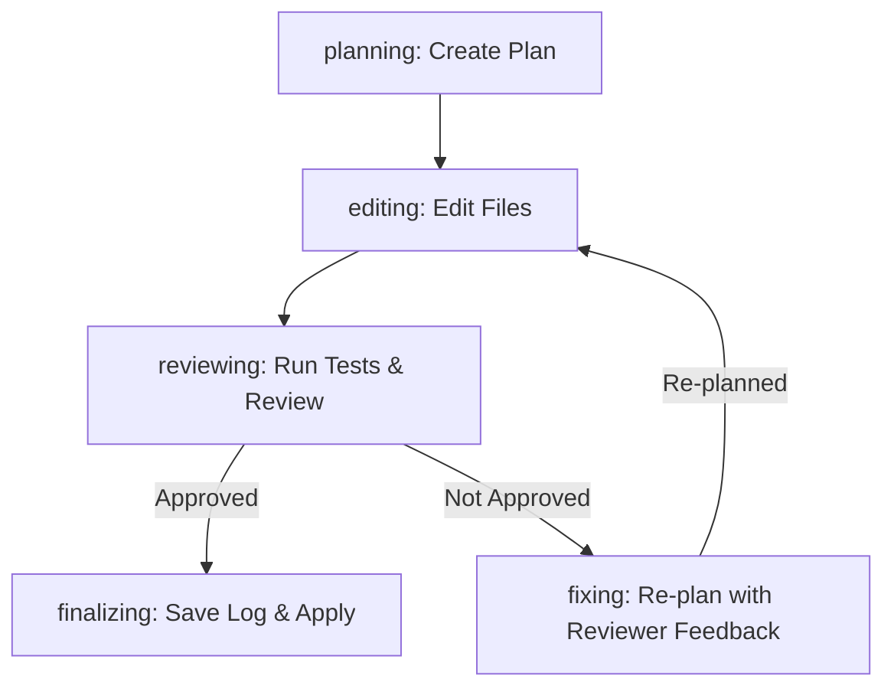

# Design Spec: Multi-turn Planning (Re-planning on Failure)

- **Date:** 2026-06-12
- **Author:** Antigravity CLI Agent
- **Status:** Proposed

## Overview
Currently, the planner agent is executed once at the start of a task. If the review/tests fail during the edit/review loop, the task transitions to the `fixing` state and runs the editor agent again without updating the plan.
To support **multi-turn planning** (Approach 3: Re-planning on failure), the planner agent will be called during the `fixing` step. It will receive previous plan summaries and reviewer feedback (including test failures) to dynamically adjust the remaining plan before the next edit pass.

## Architecture & Flow


## Detailed Changes

### 1. `TaskRunner` (src/core/task-runner.ts)
The edit/review loop in `TaskRunner.run` will be updated to execute `planStep` during the `fixing` state:
```typescript
        // Check if we need another pass
        if (!approved && state.editPass < state.maxEditPasses) {
          await stateMachine.executeStep('fixing', async () => {
            this.logger.info(`Edit pass ${state.editPass} not approved — re-planning...`);
            await planStep(stepContext);
          });
        }
```

### 2. `Planner Agent` (src/agents/planner-agent.ts)
The prompt in `plannerAgent` will be updated to check for `task.reviewResults`. If any prior review results exist, they will be appended to the LLM context so the planner can revise its plan:
```typescript
        let userContent = `Task: ${request}\n\nSelected files context:\n${(input.files ?? [])
          .slice(0, 10)
          .map((f) => `- ${f.path}: ${f.reason}`)
          .join('\n')}`;

        if (task.reviewResults && task.reviewResults.length > 0) {
          const lastReview = task.reviewResults[task.reviewResults.length - 1];
          userContent += `\n\n### PREVIOUS IMPLEMENTATION ATTEMPT FAILURE\n` +
            `The previous implementation attempt did not pass checks. You must revise your plan to address this.\n\n` +
            `Last Plan summary: ${task.planSummary || 'None'}\n` +
            `Issues identified by reviewer:\n${lastReview.issues.map(i => `- ${i}`).join('\n')}\n` +
            `Required fixes:\n${lastReview.requiredFixes.map(f => `- ${f}`).join('\n')}`;
        }
```

## Verification & Testing
1. Update existing unit tests to mock `planStep` or verify that it is called correctly during failure.
2. Run `bun run test` to verify all 237 tests pass.
